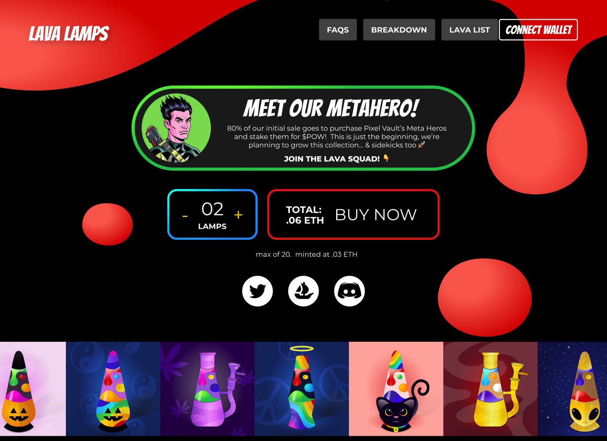
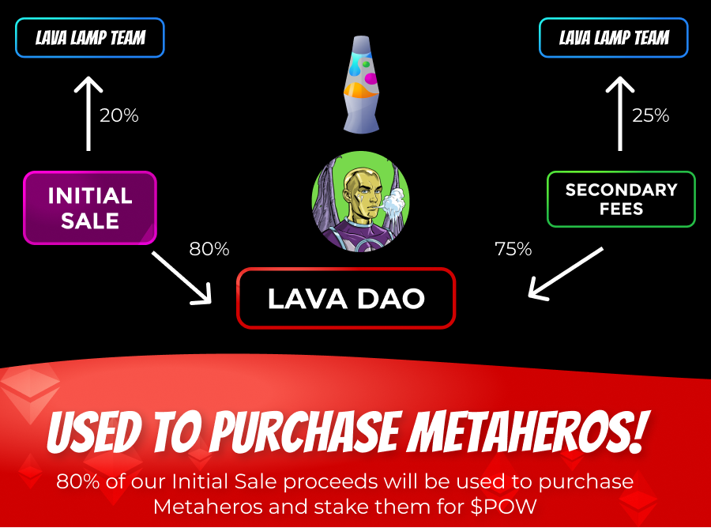

# LavaLamp NFTs

7979 LavaLamp SVGs generated by Javascript code, stored on IPFS. Bringing Nostalgia back to the blockchain.

<p align="center">
  
</p>

# Goal / Purpose

Some NFTs are very expensive and impossible to purchase alone such as metaheros($10k floor price). This NFT pools 80% of initial sales and 75% of secondary sales to purchase a metahero nft. The metahero will be staked for pow tokens and users will be allowed to vote on when to sell all assets.

<p align="center">
  
</p>

# Tech Stack
- Solidity
- React JS
- Styled-Components
- Truffle
- Ganache
- IPFS
- SVG animations
- Designed using Figma
- Hope you enjoy it!!!

# Future Plans
Stake all purchased metaheros and develop a system for users to vote, maybe using snapshot or create another smart contract. Sell all assets when the users desire and create a payment splitter smart contract for all users to withdraw their funds within the alloted time period.

# Getting Started / Running the App

First, run the development server:

```bash
npm run start
# or
yarn start
```

This project was bootstrapped with [Create React App](https://github.com/facebook/create-react-app).
